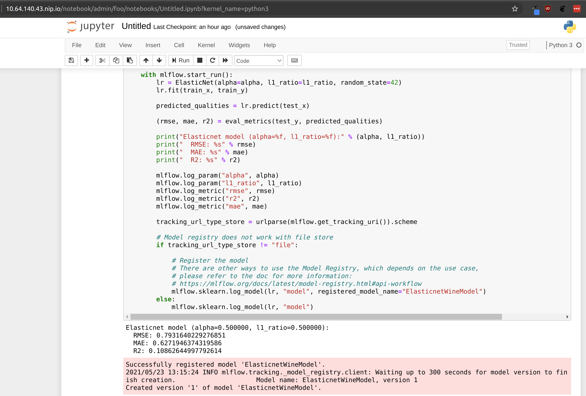

# Kubeflow + MLflow on Juju with Microk8s



How to get it running on an Ubuntu system:

If you've not installed microk8s before:
```
getent group microk8s || sudo groupadd microk8s
sudo usermod -a -G microk8s $USER
sudo chown -f -R $USER ~/.kube
sudo su - $USER
```

Start up a microk8s cluster and install kubeflow & mlflow and relate them together:
```
export DOCKER_USERNAME=<docker-hub-username>
export DOCKER_ACCESS_TOKEN=<docker-hub-password>
bash integration_test_microk8s
```

Set the docker hub username and access token to those of a docker hub pro account to avoid docker hub ratelimits.

**Note:** This will wipe out an existing microk8s cluster, so use with care.

**Note:** This may need to be retried several times, due to various Juju/Kubeflow bugs. For example if you get an error message or a 403 error after logging in.

**Note:** Min 14GB RAM needed, 50GB disk space.

Open [http://10.64.140.43.nip.io/](http://10.64.140.43.nip.io/) and log in with the username and password given in the output of the above command.

Create a new notebook server, taking care to specify the `mlflow-minio` configuration. This will ensure that the correct environment variables are set so that the MLflow SDK can connect to the MLflow server.


Now open the notebook server and paste the following code into two cells:

```
!pip install sklearn mlflow boto3
```

This will install the required dependencies.

```python
# The data set used in this example is from http://archive.ics.uci.edu/ml/datasets/Wine+Quality
# P. Cortez, A. Cerdeira, F. Almeida, T. Matos and J. Reis.
# Modeling wine preferences by data mining from physicochemical properties. In Decision Support Systems, Elsevier, 47(4):547-553, 2009.

import os
import warnings
import sys

import pandas as pd
import numpy as np
from sklearn.metrics import mean_squared_error, mean_absolute_error, r2_score
from sklearn.model_selection import train_test_split
from sklearn.linear_model import ElasticNet
from urllib.parse import urlparse
import mlflow
import mlflow.sklearn

import logging

logging.basicConfig(level=logging.WARN)
logger = logging.getLogger(__name__)


def eval_metrics(actual, pred):
    rmse = np.sqrt(mean_squared_error(actual, pred))
    mae = mean_absolute_error(actual, pred)
    r2 = r2_score(actual, pred)
    return rmse, mae, r2


if __name__ == "__main__":
    warnings.filterwarnings("ignore")
    np.random.seed(40)

    # Read the wine-quality csv file from the URL
    csv_url = (
        "http://archive.ics.uci.edu/ml/machine-learning-databases/wine-quality/winequality-red.csv"
    )
    try:
        data = pd.read_csv(csv_url, sep=";")
    except Exception as e:
        logger.exception(
            "Unable to download training & test CSV, check your internet connection. Error: %s", e
        )

    # Split the data into training and test sets. (0.75, 0.25) split.
    train, test = train_test_split(data)

    # The predicted column is "quality" which is a scalar from [3, 9]
    train_x = train.drop(["quality"], axis=1)
    test_x = test.drop(["quality"], axis=1)
    train_y = train[["quality"]]
    test_y = test[["quality"]]

    alpha =  0.5
    l1_ratio =  0.5

    with mlflow.start_run():
        lr = ElasticNet(alpha=alpha, l1_ratio=l1_ratio, random_state=42)
        lr.fit(train_x, train_y)

        predicted_qualities = lr.predict(test_x)

        (rmse, mae, r2) = eval_metrics(test_y, predicted_qualities)

        print("Elasticnet model (alpha=%f, l1_ratio=%f):" % (alpha, l1_ratio))
        print("  RMSE: %s" % rmse)
        print("  MAE: %s" % mae)
        print("  R2: %s" % r2)

        mlflow.log_param("alpha", alpha)
        mlflow.log_param("l1_ratio", l1_ratio)
        mlflow.log_metric("rmse", rmse)
        mlflow.log_metric("r2", r2)
        mlflow.log_metric("mae", mae)

        tracking_url_type_store = urlparse(mlflow.get_tracking_uri()).scheme

        mlflow.sklearn.log_model(lr, "model", registered_model_name="ElasticnetWineModel")
```

Run both cells and observe that your model metrics are recorded in MLflow!

## Roadmap

* [ ] Write intro explaining why you'd want to do this
* [ ] Publish to charm store
* [ ] Expose MLflow GUI on MetalLB
* [ ] Make `DOCKER_USERNAME` and `DOCKER_ACCESS_TOKEN` optional
* [ ] Make it work for namespaces other than admin
* [ ] Spell out the above tutorial explicitly rather than getting the user to run a script
* [ ] Reference various juju/kubeflow bugs that can cause things to fail
* [x] Record demo video
* [ ] Move to Canonical repo
